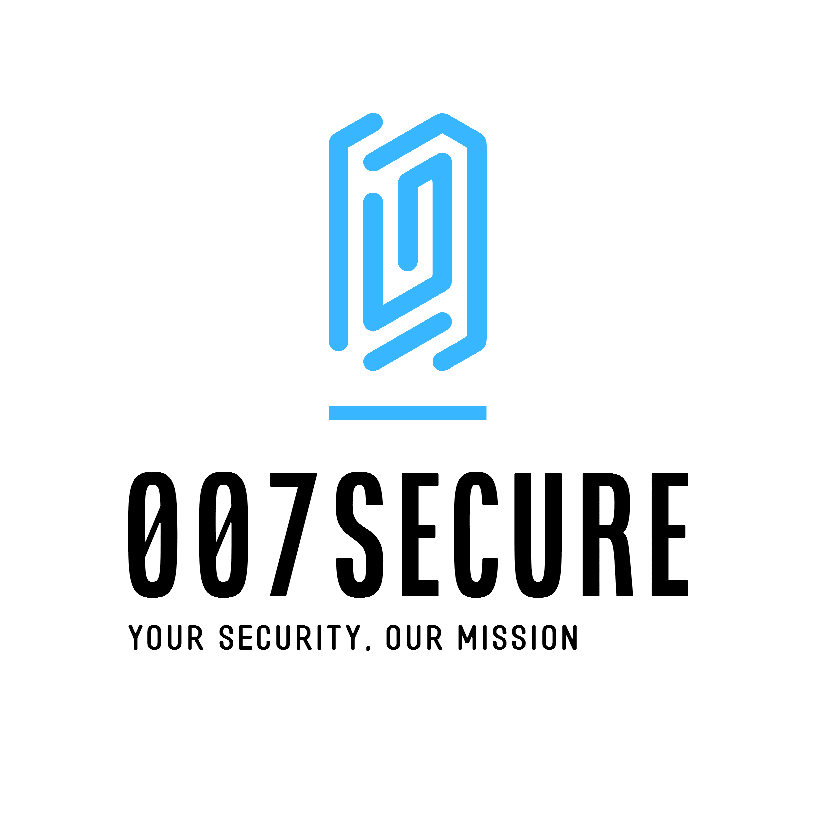

---

  
### Quick Links
  

  

  

  
 
  
 
  

---

### 007Secure tool is now live hosted on Github!

Created for [uOttaHack5](https://2023.uottahack.ca/), this website is a tool to teach the younger generation about cyber security practices. This includes :
- What is cyber security and why is it important?
- What counts as personal information?
- How to keep your personal information safe.
- A safe password generator.
- How to keep your devices safe.
- How to implement cyber secure practices in your home.
- How to prevent phishing.

---

 

**[PROJECT PHILOSOPHY](https://github.com/emma-t/007Secure#-project-philosophy) • 
[TECH STACK](https://github.com/emma-t/007Secure#-tech-stack) • 
[CONTRIBUTING](https://github.com/emma-t/007Secure#%EF%B8%8F-contributing) • 
[SPREAD THE WORD](https://github.com/emma-t/007Secure#-spread-the-word) • 
[LICENSE](https://github.com/emma-t/007Secure#%EF%B8%8F-license)**

 

# 🧐 Project philosophy

> 

**Read more about...**

# 👨‍💻 Tech stack

Here's a brief high-level overview of the tech stack the 007Secure uses:

- 

# ✍️ Contributing

# 🌟 Spread the word!

If you want to say thank you and/or support active development of 007Secure:

- Add a GitHub Star to the project!

Thanks so much for your interest in growing the reach of 007Secure!

# ⚠️ License

 

